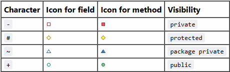

# Mini-Shopify

## Project Description
Mini-Shopify is a web-based e-commerce platform built with Spring Boot that allows merchants to create online and manage online shops while customers can browse products, add items to their cart, and complete purchases through a simulated checkout process.

## Deployment
**Live Application:** [minishopify-b8gtdzgpawc9fdan.eastus2-01.azurewebsites.net](http://minishopify-b8gtdzgpawc9fdan.eastus2-01.azurewebsites.net)

## Current Features (Sprint 2)
### Merchant Features
* Merchant registration and authentication
* Create and manage multiple shops
* Add, update, and remove products from shops
* View all products and shops owned by the merchant
* Manage product inventory (stock levels, pricing)

###   Customer Features
* Customer registration and authentication
* Browse all available shops and products
* Search products by name, description, or shop name
* Add products to shopping cart
* Update product quantities in cart
* Remove products from cart
* View cart with real-time totals
* Complete checkout with shipping and payment information
* View order confirmation after successful purchase

### System Features
* Role-based access control (Merchant vs Customer)
* Secure authentication with Spring Security
* Password encryption using BCrypt
* RESTful API endpoints for data access
* Automatic test data generation with Faker library
* Responsive web interface with modern CSS styling
* Real-time stock management
* Tax calculation (13% HST)
* Input validation and error handling

## Technology Stack
- **Backend:** Spring Boot 3.5.6, Spring MVC, Spring Data JPA
- **Database:** H2 (in-memory)
- **Frontend:** Thymeleaf templates, HTML/CSS
- **Build Tool:** Maven
- **CI/CD:** GitHub Actions
- **Deployment:** Azure Web Apps
- **Data Generation:** JavaFaker

## Database Schema

### Entity Relationship Diagram
```
┌─────────────────┐
│    Merchant     │
├─────────────────┤
│ id (PK)         │
│ name            │
│ email (UNIQUE)  │
│ password        │
│ userType        │
│ shops           │
└────────┬────────┘
         │
         │ 1:N
         │
┌────────▼────────┐
│      Shop       │
├─────────────────┤
│ id (PK)         │
│ name            │
│ categories      │
│ products        │
│ merchant_id(FK) │
└────────┬────────┘
         │
         │ 1:N
         │
┌────────▼────────┐
│    Product      │
├─────────────────┤
│ id (PK)         │
│ name            │
│ description     │
│ price           │
│ stock           │
│ shop_id (FK)    │
└─────────────────┘

┌─────────────────┐
│    Customer     │
├─────────────────┤
│ id (PK)         │
│ name            │
│ email (UNIQUE)  │
│ password        │
│ userType        │
│ cart_id (FK)    │
└────────┬────────┘
         │
         │ 1:1
         │
┌────────▼────────┐
│      Cart       │
├─────────────────┤
│ cartID (PK)     │
│ customer_id(FK) │
│ cartItems       │
└────────┬────────┘
         │
         │ 1:N
         │
┌────────▼────────┐
│   CartItem      │
├─────────────────┤
│ id (PK)         │
│ cart_id (FK)    │
│ product_id (FK) │
│ quantity        │
└─────────────────┘
```

### ORM Patterns Used
- **One-to-Many:** Merchant → Shop (bidirectional)
- **One-to-Many:** Shop → Product (bidirectional)
- **One-to-One:** Customer → Cart (bidirectional)
- **One-to-Many:** Cart → CartItem (bidirectional)
- **Many-to-One:** CartItem → Product (unidirectional)
- **Element Collection:** Shop → Categories (list of strings)
- **Cascade Operations:** CascadeType.ALL on Shop products and Merchant shops, and Cart items
- **Orphan Removal:** Enabled on Shop products and Cart items

## UML Class Diagram
See `Diagrams/UMLClass_Diagram.png` for the complete PlantUML model diagram.

### Class Diagram Legend


## Project Structure
```
src/
├── main/
│   ├── java/org/example/
│   │   ├── ShopAppApplication.java
│   │   ├── controllers/
│   │   │   ├── CartController.java
│   │   │   ├── CheckoutController.java
│   │   │   ├── CustomerController.java
│   │   │   ├── GuiController.java
│   │   │   ├── MerchantController.java
│   │   │   ├── ProductController.java
│   │   │   ├── SearchController.java
│   │   │   └── ShopController.java
│   │   ├── models/
│   │   │   ├── Cart.java
│   │   │   ├── CartItem.java
│   │   │   ├── Customer.java
│   │   │   ├── Merchant.java
│   │   │   ├── Product.java
│   │   │   ├── Shop.java
│   │   │   └── UserType.java (enum)
│   │   ├── repository/
│   │   │   ├── CartRepository.java
│   │   │   ├── CustomerRepository.java
│   │   │   ├── MerchantRepository.java
│   │   │   ├── ProductRepository.java
│   │   │   └── ShopRepository.java
│   │   └── security/
│   │       ├── CustomUserDetails.java
│   │       ├── CustomUserDetailsService.java
│   │       └── SecurityConfig.java
│   └── resources/
│       ├── static/css/
│       │   └── styles.css
│       └── templates/
│           ├── add-product.html
│           ├── cart.html
│           ├── checkout.html
│           ├── checkout-confirmation.html
│           ├── custom-error.html
│           ├── customer-profile.html
│           ├── index.html
│           ├── login.html
│           ├── merchant-profile.html
│           ├── register-customer.html
│           ├── register-merchant.html
│           ├── search.html
│           ├── shop.html
│           └── shops.html
└── test/
    └── java/org/example/
        ├── controllers/
        │   ├── CheckoutControllerTest.java
        │   ├── GuiControllerIntegrationTest.java
        │   └── RestApiIntegrationTest.java
        ├── models/
        │   ├── CartItemTest.java
        │   ├── CartTest.java
        │   ├── CustomerTest.java
        │   ├── MerchantTest.java
        │   ├── ProductTest.java
        │   └── ShopTest.java
        └── repository/
            ├── CartRepositoryIntegrationTest.java
            ├── CustomerRepositoryIntegrationTest.java
            ├── MerchantRepositoryIntegrationTest.java
            ├── ProductRepositoryIntegrationTest.java
            └── ShopRepositoryIntegrationTest.java
```

## Setup Instructions

### Prerequisites
- Java 17 or higher
- Maven 3.6+
- Git

### Local Development
1. Clone the repository:
   ```bash
   git clone <https://github.com/ashkkumar/MiniShopify>
   cd mini-shopify
   ```

2. Build the project:
   ```bash
   mvn clean install
   ```

3. Run the application:
   ```bash
   mvn spring-boot:run
   ```
4. Access the application at: http://localhost:8080/gui/

### Test Users
The application automatically generates 10 merchants with 30 shops and 150 products using the Faker library. You can also register new users:

* Merchant Registration: /gui/register/merchant
* Customer Registration: /gui/register/customer

Default password for all generated merchants: password

### Running Tests
```bash
mvn test
```

## API Endpoints

### REST API (Spring Data REST)
- `GET /merchants` - List all merchants
- `POST /merchants` - Create a merchant
- `GET /merchants/{id}` - Get merchant by ID
- `GET /shops` - List all shops
- `POST /shops` - Create a shop
- `GET /shops/{id}` - Get shop by ID
- `GET /products` - List all products
- `POST /products` - Create a product
- `GET /products/{id}` - Get product by ID

### GUI Endpoints
#### Public Routes
- `GET /gui/` - Home page
- `GET /gui/login` - Login page
- `GET /gui/register/merchant` - Merchant registration
- `GET /gui/register/customer` - Customer registration
- `GET /gui/shops` - View all shops (Public Access)
- `GET /gui/search` - Search products

#### Merchant Routes (Role: MERCHANT)
* `GET /gui/merchant/profile` - Merchant dashboard
* `POST /gui/merchant/add-shop` - Create new shop
* `POST /gui/merchant/add-product` - Add product to shop
* `POST /gui/merchant/remove-shop` - Remove shop
* `POST /gui/merchant/remove-product` - Remove product

#### Customer Routes (Role: CUSTOMER)
* `GET /gui/customer/profile` - Customer dashboard
* `GET /gui/customer/cart` - View shopping cart
* `POST /gui/customer/cart/add` - Add product to cart
* `POST /gui/customer/cart/remove` - Remove product from cart
* `POST /gui/customer/cart/update` - Update cart quantity
* `POST /gui/customer/cart/clear` - Clear entire cart
* `GET /gui/customer/checkout` - Checkout page
* `POST /gui/customer/checkout/process` - Process order
* `GET /gui/customer/checkout/confirmation` - Order confirmation

## Security Configuration
### Authentication
* Form-based authentication with email and password
* BCrypt password encryption
* Custom UserDetailsService for loading user data
* Session-based authentication with JSESSIONID cookie

### Authorization
* Role-based access control (RBAC)
* Two user roles: CUSTOMER and MERCHANT
* Route protection using Spring Security annotations
* Automatic role-based dashboard redirection after login

### Protected Routes
* Merchant routes: Require ROLE_MERCHANT
* Customer routes: Require ROLE_CUSTOMER
* Public routes: No authentication required

## Current Sprint Status (Sprint 2)
### Completed
- Project setup with CI/CD pipeline
- Azure deployment configuration
- Basic models (Merchant, Shop, Product)
- Repository layer with Spring Data JPA
- GUI for shop and product management
- Unit tests for all models
- Integration tests for controllers and repositories
- Product-Shop relationship implementation
- Customer shopping cart
- Product search by category
- Merchant authentication and login
- Customer user accounts
- Shopping cart implementation
- Checkout process (simulated payment)
- Search functionality (by shop name and category)

### Planned for Next Sprint
* Fix bug with register on Azure deployment 
* Shop categories functionality
* Order history tracking for customers
* Product reviews and ratings
* Advanced search with filters (price range, categories)
* Merchant analytics dashboard
* Email notifications for order confirmations
* Product images upload and display
* Wishlist functionality
* Multiple payment methods simulation
* Invoice generation
* Admin panel for system management

## Team Members
- Ajen Srisivapalan
- Andrew Roberts
- Ashwin Kumar
- Jason Keah
- Nick Fuda

## Project Management
- **[Kanban Board](https://github.com/users/ashkkumar/projects/4)** 
- **Weekly Scrums:** See GitHub Issues for weekly updates
- **CI/CD:** Automated via GitHub Actions

## License
This project is created as part of SYSC 4806 coursework.
